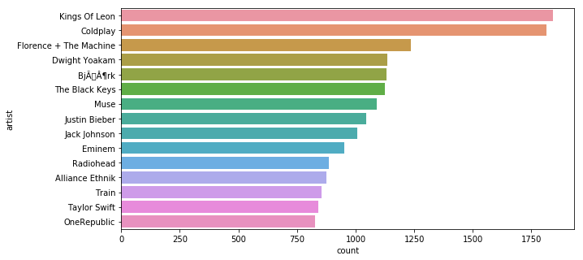
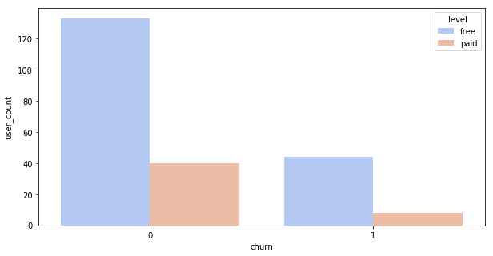
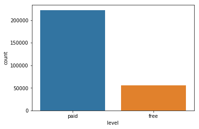
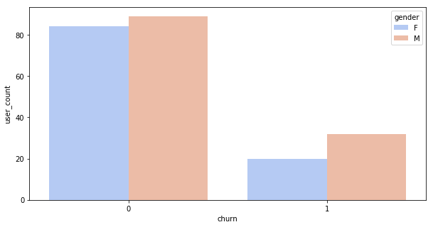
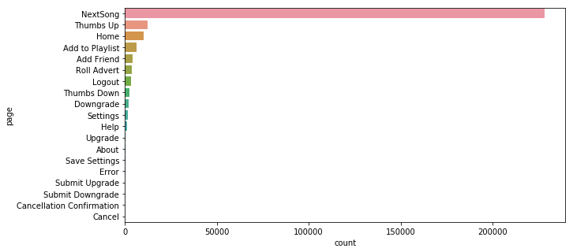

## Predicting Churn of Customers

There are many users who use free service of music streaming. I wanted to know the users who unsubscribe when the free service ends, so that we can offer them discounts to maximize the revenue.

### Part I: What are the most popular artist across the users sessions?

Below is the screenshot of top15 artists across user sessions. Users prefer mostly Kings Of Leon and Coldplay. 

### Part II: What is the distribution of level (free or paid) vs Churn?

We can see there are more users who take free subscription and then cancel when subscription ends. 

But suprisingly when looking at all the events paid users are more than free users, as below.

### Part III: What is the distribution of gender vs Churn?

More male users than female users using the service and the number of events corresponding to male users is greater than the number of events for female users.

### Part IV: What is the distribution of page users visit?

Most users been to NextSong page, following Thumbs Up and Home etc., May be we can aggregate the songs across the user sessions and use that as a features and its corresponding descriptive statistics.

### Conclusion

In this article, we looked at Sparkify users transaction data to predict the churn of an user.

There were some useful insights found at each part of our questions, but equally there were some questions left unanswered. Three high level takeaways include:

Sparkify users appear to use more free subscriptions, and cancel the subscription when free subscription ends. Surprisingly paid users listen to the songs more than free users.

There are other descriptive statics based on user sessions which were used in model building.

Simple model, Logistic Regression seemed to perform well, with proper cross validation, which identified best parameters.
